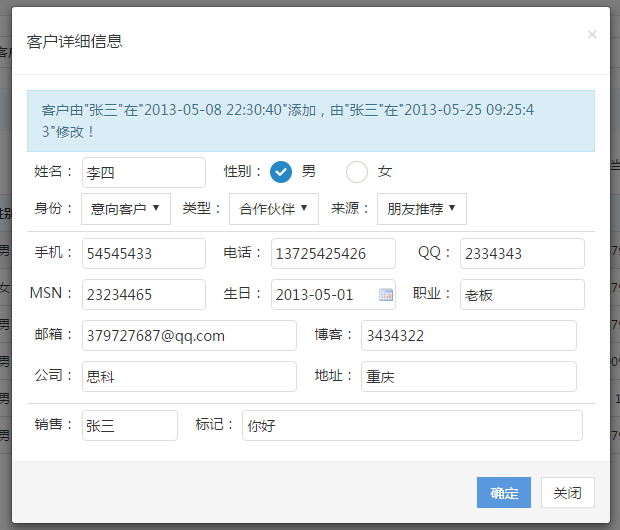
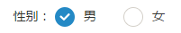

# HouseCRM

## 2月22日

1. 解决中文乱码问题

    在JDBC的url中指定编码为`UTF-8`
    
    ```properties
    jdbc.url=jdbc:mysql://59.110.156.116:3306/crm?characterEncoding=UTF-8
    ```

## 2月21日

实现添加新客户，以下问题暂未得到解决：

1. 中文乱码

    在Action类中收到的参数正常无乱码，但是插入到数据库中数据就会乱码，一般首先会想到的都是数据库的问题，但是直接写SQL插入数据库是正常的

2. 添加成功之后自动刷新界面

## 2月20日

1. 实现用户登录

2. 使用拦截器实现登录验证

## 2月18日

### Spring配置事务不生效

Spring配置事务不生效，产生的原因是MySQL存储引擎没有使用支持事务的`InnoDB`，而是使用了不支持事务的`MyISAM`，修改方式很简单，如下：

找到MySQL安装目录，打开`my.ini`文件，修改`default-storage-engine`属性，修改之后，保存并重启MySQL服务

```properties
#使用支持事务的InnoDB引擎
default-storage-engine=InnoDB
```

学到的两条sql：

1. 查看当前版本的MySQL是否支持`InnoDB`存储引擎
    
    ```sql
    SHOW ENGINES;
    ```
    
2. 查看当前默认的存储引擎

    ```sql
    SHOW VARIABLES LIKE '%storage_engine%';
    ```


### 表单数据验证

使用`jquery.validate.js`进行表单的数据验证

## 2月17日

### 整合Struts2，去除之前的Servlet

1. 加入Struts2的jar包

    添加`struts2-blank.war`解压之后的全部jar包，以及`struts2-spring-plugin-2.3.31.jar`
    
2. 在`struts.xml`中加入以下配置

    ```xml
    <constant name="struts.objectFactory" value="spring"/>
    ```
    
3. Struts2配置文件`struts.xml`中,`action`标签的`class`属性，从之前的指向全类名改为`Spring`中`bean`的id
    ```xml
    <action name="list" class="customerAction" method="queryAllUsed">
        <result name="success">/WEB-INF/pages/customer-list.jsp</result>
    </action>
    ```
    
### 完善客户信息弹窗



1. 禁止表单中的所有表单元素编辑

    ```javascript
    $('select,input,textarea',$('form[name="customer_form"]')).attr('disabled','disabled');
    ```

2. 恢复表单元素可编辑

    ```javascript
    $('select,input,textarea',$('form[name="customer_form"]')).removeAttr('disabled');
    ```

### 使用iCheck美化单选框



1. 引入所需的文件

    ```html
    <link rel="stylesheet" type="text/css" href="XXX/iCheck/1.0.2/skins/all.css"/>
    <script type="text/javascript" src="XXX/iCheck/1.0.2/icheck.min.js"></script>
    ```

2. 编写input标签

    ```html
    <input id="male" type="radio" name="sex"><label for="male">男</label>
    <input id="female" type="radio" name="sex"><label for="female">女</label>
    ```

3. 启用ICheck

    ```javascript
    //启动iCheck
    $(("[type='radio']")).iCheck({
        checkboxClass: 'icheckbox_minimal-blue',
        radioClass: 'iradio_square-blue'
    });
    ```

## 2月16日

- 使用Servlet完成客户信息的查询
- 弹窗显示客户详细信息

## 2月15日

- 环境准备前端界面使用Hui-Admin

    [http://www.h-ui.net/H-ui.admin.shtml](http://www.h-ui.net/H-ui.admin.shtml)

- 数据库使用MySQL

- 使用Spring框架

- 数据库连接池使用：`druid-1.0.21.jar`